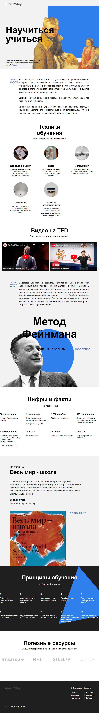

**[Проект: Как научиться учиться?](https://aleksandr-hohlov.github.io/first-project)**

**Описание проекта:**

- файловая структура реализована по БЭМ;
- проект создан по макету Figma;

Реализовано:

- iframe;
- анимации;
- трансформации;

---

**_https://aleksandr-hohlov.github.io/first-project_**

---

